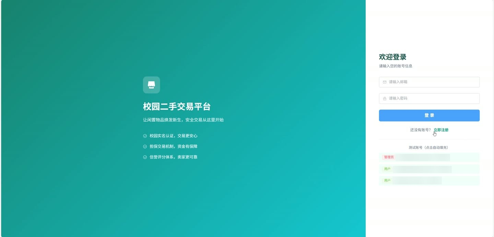
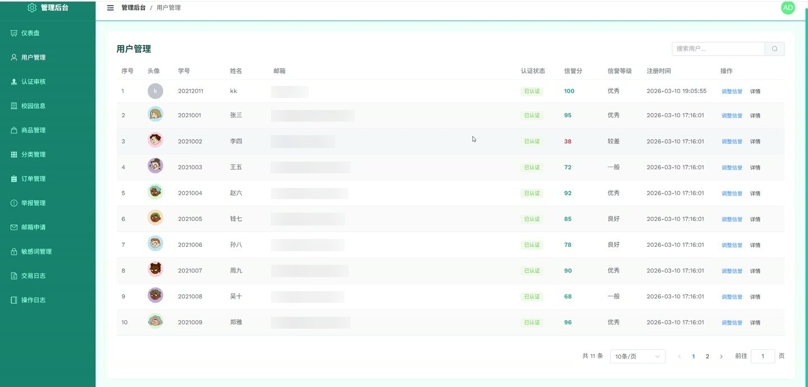
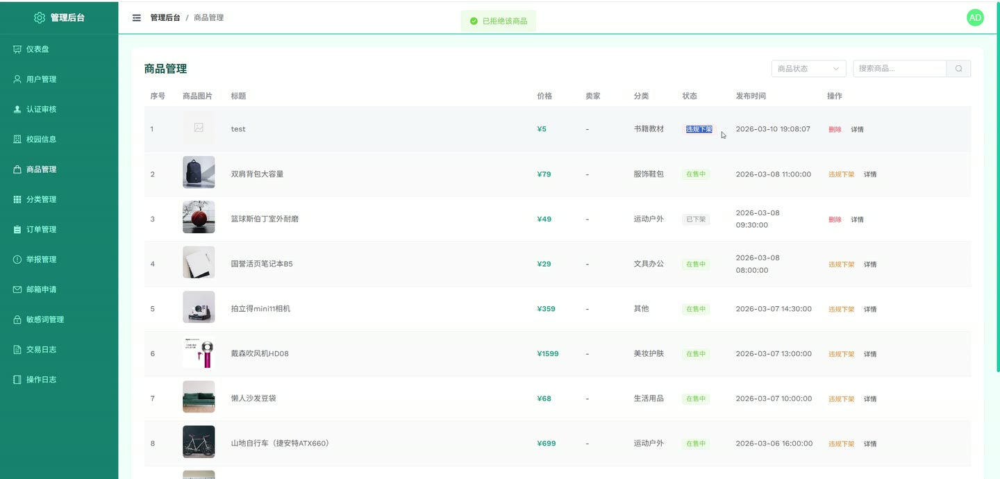
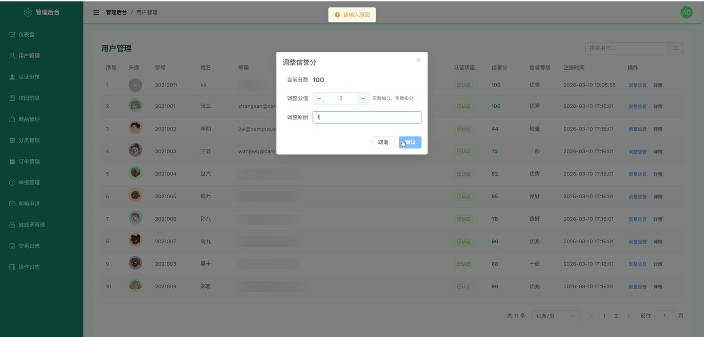

# (附文档)Springboot3+Vue3+MySQL 校园二手商品交易平台

**技术栈**：Springboot3、Vue3、MySQL

### 系统简介

本系统是一套前后端分离的校园二手商品交易平台，后端基于 Spring Boot 3 + Spring Security + MyBatis-Plus，前端基于 Vue 3 + Element Plus。系统包含普通用户端和管理员端两大角色，提供商品发布、搜索、收藏、下单、支付、聊天、评价、举报、实名认证、信誉分管理、敏感词过滤等完整交易闭环功能。
 
### 核心功能
 
### 普通用户端

 
- 注册/登录：通过学号+姓名+邮箱匹配校园信息库进行注册，支持邮箱验证码；登录后返回 JWT 令牌及用户基本信息。 
- 浏览商品：按分类、关键词、价格范围、商品状态等条件搜索商品列表，支持分页与排序。 
- 搜索联想与热词：输入关键词时自动提示联想词，首页展示热门搜索词。 
- 商品详情：查看商品图片、描述、价格、分类、发布时间、卖家信息及商品评价。 
- 发布/编辑商品：填写商品标题、描述、价格、分类并上传多张图片，支持保存为草稿或直接提交审核。 
- 管理我的商品：查看自己发布的商品列表，按状态（待审核/在售/已下架/审核驳回）筛选，支持提交审核、下架、删除操作。 
- 收藏商品：对感兴趣的商品进行收藏/取消收藏，查看我的收藏列表。 
- 下单与支付：选择商品创建订单，模拟支付操作完成订单支付。 
- 订单管理（买家视角）：查看我的购买订单列表，按状态筛选，支持确认收货、取消订单、申请退款、发起争议。 
- 订单管理（卖家视角）：查看我卖出的订单列表，支持发货、同意退款、拒绝退款（转争议）。 
- 评价系统：交易完成后对商品进行评分和文字评价，卖家可回复评价；查看我收到的评价。 
- 即时聊天：与卖家/买家发送文本消息，支持按商品关联聊天，查看会话列表，标记已读，显示未读消息数。 
- 消息敏感词检测：发送消息时实时检测是否包含敏感词并提示警告。 
- 举报商品/用户：提交举报并填写举报原因和类型，查看自己的举报记录。 
- 实名认证：上传学生证照片提交认证申请，等待管理员审核。 
- 个人信息管理：修改昵称、手机号、个人简介，上传头像。 
- 邮箱修改：提交新邮箱申请修改，由管理员审核通过后生效。 
- 信誉分查看：查看自己的信誉分、信誉等级及变动记录。 
- 信誉恢复答题：参与信誉知识答题，答对后恢复信誉分。 
- 猜你喜欢：基于用户协同过滤算法获取个性化推荐商品列表。 
- 热门商品：查看系统推荐的热门在售商品。
 
### 管理员端

 
- 仪表盘：查看平台总用户数、待审核认证数、商品总数、在售商品数、待审核商品数、订单总数、争议订单数、退款中订单数。 
- 用户管理：查看所有普通用户列表，按关键词搜索，查看用户详情。 
- 实名认证审核：查看待审核的认证申请列表，支持通过或驳回并填写驳回原因。 
- 信誉分管理：对指定用户调整信誉分（增/减），填写调整原因。 
- 校园学生信息管理：新增、导入（Excel模板下载）、查询校园学生信息列表，显示注册状态。 
- 商品管理：查看所有商品列表，支持按状态、分类、关键词筛选，审核商品（通过/驳回），违规下架（填写原因），普通下架，删除商品。 
- 分类管理：新增/编辑/删除商品分类，删除时校验分类下是否有商品。 
- 订单管理：查看所有订单列表，支持按状态筛选，强制退款，处理争议（填写处理结果并选择是否退款）。 
- 举报管理：查看举报列表，按状态筛选，处理举报（判定有效/无效，填写处理结果，可选扣减信誉分）。 
- 聊天记录查看：查看任意两个用户之间的完整聊天记录。 
- 邮箱修改申请：查看用户提交的邮箱修改申请列表，审核通过/驳回，通过后自动更新用户邮箱及校园信息表邮箱。 
- 敏感词管理：新增、编辑（修改词内容/启用状态）、删除敏感词，支持分页查询。 
- 日志管理：查看交易日志（按订单ID筛选）和系统操作日志（按模块筛选），支持分页。
 
### 技术栈

 后端框架Spring Boot 3 ORMMyBatis-Plus 权限认证Spring Security + JWT 前端框架Vue 3 状态管理Pinia 构建工具Vite 数据库MySQL 缓存Redis (容错模式，不可用时自动降级) 邮件服务JavaMailSender (QQ邮箱) 文件上传本地文件存储 Excel处理Apache POI
 
### 交付内容

 
- 后端完整源码 
- 前端完整源码 
- 数据库初始化脚本 
- 万字文档

## 界面展示

---

## 获取完整源码 + 万字文档

本仓库为项目介绍页。**完整前后端源码、数据库初始化脚本、万字项目文档**，请加微信 `kangkangcode`，或访问 [codekk.top](http://codekk.top) 获取。

可作课程设计 / 毕业设计参考，支持远程部署调试。